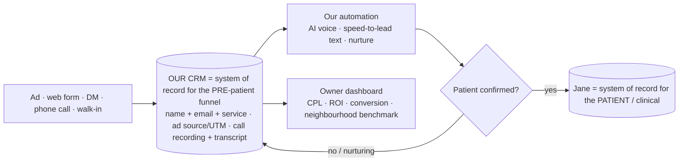

# Data Architecture — where every piece of data lives

*Answers "where will the data sit, where do I get it, how do I see it." Two completely different kinds of data — don't confuse them.*

## The two data layers (this is the key distinction)

| | **KNOWLEDGE layer** (now) | **PRODUCT / RUNTIME layer** (built later) |
|---|---|---|
| **What** | Decisions, research, the Vertical Bible, personas, mind-maps, plans | Live leads, calls, transcripts, ad-attribution, patients, appointments |
| **Source of truth** | **GitHub repo** (Markdown, version-controlled) | **The SaaS app's database** (the CRM we build) |
| **How you SEE it** | **Obsidian** (point a vault at the cloned repo) · GitHub renders it · Markmap for mind-maps | The app's **owner dashboard** (CPL, ROI, conversion, benchmark) |
| **Optional extra** | **Notion** — only if you want prettier persona DB tables (risk: a 2nd source of truth → drift; keep the repo canonical) | — |
| **Tools** | Free: GitHub + Obsidian + Markmap. Paid: maybe Apify (transcript scrape), Gemini (video) | Supabase/Postgres, multi-tenant, Canadian region, BAA (see `PROJECT_BRIEF.md`) |

**Rule:** ONE source of truth per layer. Knowledge = the repo (view in Obsidian). Runtime = the app DB. Don't scatter.

## ★ The lead-data flow — YOU ARE RIGHT, this corrects my earlier suggestion

You spotted the flaw: **if leads go straight into Jane (or Jane's booking page), WE never get the data → no automation, no attribution.** Correct. So the model is:

**The leads, calls, and transcripts live in OUR CRM — NOT Jane.** Clinics don't put anyone in Jane until they convert, so the entire pre-patient funnel is ours to own (that's the whole moat). **Only the CONFIRMED patient is handed to Jane.**

### The handoff to Jane (write) — interim until partnership
Jane's API write isn't confirmed yet, so to push a confirmed patient into Jane without double-entry:
1. **Best (later):** Jane Developer Platform partnership → API write. *(Apply later, as you said.)*
2. **Interim (your idea — good):** an **AI/RPA agent that fills Jane's new-patient form** for confirmed leads. ⚠️ Honest flag: RPA is **fragile** (breaks when Jane changes its UI) and needs care on ToS/credentials — fine for **low volume at first**, not a forever solution. Revisit when volume grows or partnership lands.
3. **Fallback:** front desk manually enters the confirmed patient (they do this today anyway) — zero engineering, fine for pilot.

→ **We do NOT route leads through Jane's hosted booking page** (that loses the data). Booking happens in OUR flow; Jane gets the confirmed patient.

## Call tracking (module A detail)
Each clinic gets a **tracking number** (or we forward their existing line) → inbound calls route through our voice layer (Retell/Twilio-class) → **recorded + transcribed + stored in OUR CRM**, tied to the ad source. So every inbound call + transcript sits in one place, by clinic.

## Where the Vertical Bible / personas sit
In the **repo** (`VERTICAL_BIBLE.md` or a `/vertical/` folder) → viewed in **Obsidian**. If you prefer DB tables for personas, mirror them in **Notion** — but keep the repo canonical.

## How to SEE all of it
- **Obsidian** (your Mac): open the cloned repo folder as a vault → all `.md` render; `MINDMAP.md` shows the map; open `SaaS_Map.canvas` for the visual board.
- **Markmap** for an interactive one-frame mind-map (paste the outline from `MINDMAP.md`).
- **GitHub** renders everything online.
