# Decision Mind-Map — where we've thought, where we haven't

*Visual of the whole project. Renders on GitHub (Mermaid). Status: ✅ decided/validated · 🔵 leaning / in-progress · ⚪ open / not yet thought through. Also viewable as an interactive mind-map in Markmap (markmap.js.org), Obsidian, or by pasting into Mermaid Live (mermaid.live). Text source of truth = `RESEARCH_BRAIN.md`.*

```mermaid
graph TD
    ROOT[Billion-$ Practitioner Growth Platform<br/>physio beachhead → multi-vertical]

    ROOT --> MK[MARKET]
    MK --> MK1[Gap: no clinic-native ad→booked CRM ✅]
    MK --> MK2[44.5% run ads — measured ✅]
    MK --> MK3[Beachhead: physio, Canada ✅]
    MK --> MK4[Billion-$ roadmap / numbers ⚪]

    ROOT --> PR[PRODUCT V1 — beside Jane]
    PR --> PRA[A. Missed-call/after-hours capture ✅]
    PR --> PRB[B. Speed-to-lead pipeline CRM ✅]
    PR --> PRC[C. Ad→patient attribution + dashboard ✅ = moat]
    PR --> PRD[D/E. Rebooking + reactivation 🔵]
    PR --> PRF[Market/neighbourhood benchmark ✅ concept · cold-start 🔵]

    ROOT --> INT[INTEGRATION w/ Jane]
    INT --> INT1[Jane has NO open API ✅ fact]
    INT --> INT2[Own-the-funnel: capture lead+book in OUR system, push to Jane ✅ approach]
    INT --> INT3[Google Calendar bridge 🔵 fallback]
    INT --> INT4[Jane vetted-partner API ⚪ apply]
    INT --> INT5[Founder's own stack idea ⚪ study when shared]

    ROOT --> CMP[COMPLIANCE]
    CMP --> CMP1[Verified BAA stack ✅]
    CMP --> CMP2[Canada data-residency = moat ✅]
    CMP --> CMP3[Server-side PII-stripped ad tracking ✅ why-we-own-funnel]

    ROOT --> BR[BRAND / GTM / SEO]
    BR --> BR1[One umbrella co + platform ✅]
    BR --> BR2[One domain + vertical landing pages 🔵 recommend]
    BR --> BR3[One strong social, niche content lanes 🔵 recommend]
    BR --> BR4[Direct-to-owner, simple onboarding ✅ primary]
    BR --> BR5[Agency-enablement / training ⚪ Phase-2 lever]
    BR --> BR6[Name: CRM not ERP ✅ · SEO target = job terms 🔵]

    ROOT --> ARCH[ARCHITECTURE]
    ARCH --> ARCH1[Modular, multi-tenant, vertical=config not fork 🔵 principle]
    ARCH --> ARCH2[Typed + tested boundaries — avoid ERP fragility 🔵]
    ARCH --> ARCH3[Stack choice — score alternatives ⚪ after founder shares his]

    ROOT --> TEAM[TEAM / EXECUTION]
    TEAM --> TEAM1[Founder + dev + AI + PPC Guru team ✅]
    TEAM --> TEAM2[Co-founder — open ⚪]
    TEAM --> TEAM3[Physio advisors 🔵]
    TEAM --> TEAM4[Brainstorm-first, then build ✅ working style]

    ROOT --> VAL[VALIDATION]
    VAL --> VAL1[2 physio-owner interviews ✅ confirm gap+voice]
    VAL --> VAL2[8–12 interviews + price + LOIs 🔵 in progress]
    VAL --> VAL3[Jane walkthrough brief ⚪ founder to provide]

    classDef done fill:#d4edda,stroke:#28a745,color:#155724;
    classDef lean fill:#cce5ff,stroke:#0066cc,color:#004085;
    classDef open fill:#fff3cd,stroke:#ffc107,color:#856404;

    class MK1,MK2,MK3,PRA,PRB,PRC,INT1,INT2,CMP1,CMP2,CMP3,BR1,BR4,BR6,TEAM1,TEAM4,VAL1 done;
    class PRD,PRF,INT3,BR2,BR3,ARCH1,ARCH2,TEAM3,VAL2 lean;
    class MK4,INT4,INT5,BR5,ARCH3,TEAM2,VAL3 open;
```

## The 7 open ⚪ fronts we still owe a deep, alternatives-scored answer
1. **Billion-$ roadmap + numbers** (physio→dental→practitioners→local-service; staged ARR math).
2. **Jane integration options** — full teardown of every path (own-funnel / GCal / partner API / founder's stack), scored for data-fidelity + scale.
3. **The build stack** — score alternatives for fast-start + easy-scale (after you share your stack).
4. **Agency-enablement** as a Phase-2 distribution lever.
5. **Co-founder** decision.
6. **Jane walkthrough brief** (you provide → I study for 100% ground truth).
7. **Final brand/domain/social structure** (lean = one domain; confirm).
