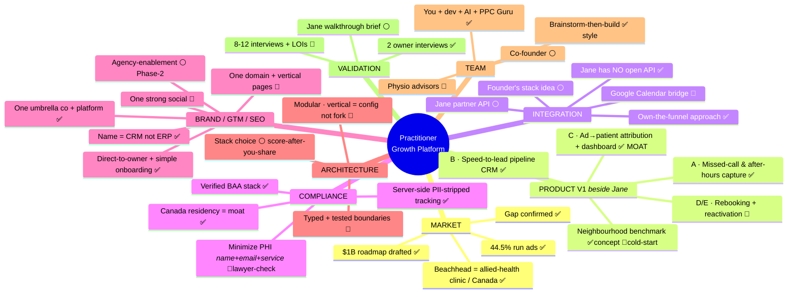
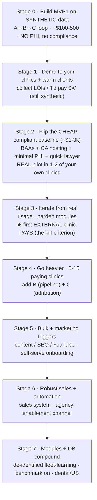

# Decision Mind-Map — readable views

*Status: ✅ decided/validated · 🔵 leaning · ⚪ open. Two formats below — pick whichever reads best. Text source of truth = `RESEARCH_BRAIN.md`.*

> **How to view / sync (your tools):**
> - **GitHub:** open this file → the Mermaid diagrams auto-render.
> - **Obsidian:** paste a ```` ```mermaid ```` block into a note (Obsidian renders Mermaid `mindmap`). For the collapsible outline, just paste the bullet list — Obsidian's outline/mind-map plugins fold it.
> - **Markmap** (markmap.js.org) — best interactive one-frame mind-map: paste the **nested bullet outline** (View 2).
> - **draw.io:** it can open files **directly from GitHub** — in draw.io, *File → Open from → GitHub*, authorize, pick this repo/branch/file. Then *File → Open* again after I push to pull the latest (closest to "auto-sync" without custom automation). Or import the Mermaid via *Arrange → Insert → Mermaid*.
> - **Auto-sync:** true live auto-sync needs a GitHub Action/webhook into your tool; not worth it. Practical path = the draw.io "Open from GitHub" above (re-open to refresh), or just refresh the GitHub page.

---

## View 1 — Mermaid mind-map (radial, fits one frame; the "Obsidian way")



---

## View 2 — Nested outline (most readable as text; paste into Markmap/Obsidian)

- **Practitioner Growth Platform** — physio/chiro/massage clinic → multi-vertical
  - **Market**
    - ✅ Gap confirmed (no clinic-native ad→booked CRM)
    - ✅ 44.5% run ads (measured)
    - ✅ Beachhead = multi-disciplinary allied-health clinic, Canada
    - ✅ $1B roadmap drafted
  - **Product V1 (beside Jane)**
    - ✅ A — Missed-call & after-hours capture *(wedge)*
    - ✅ B — Speed-to-lead pipeline (clinic-native CRM)
    - ✅ C — Ad→patient attribution + owner dashboard *(MOAT)*
    - 🔵 D/E — Rebooking nudges + reactivation engine
    - 🔵 Neighbourhood benchmark (concept ✅, cold-start to solve)
  - **Integration with Jane**
    - ✅ Jane has no open API (fact)
    - ✅ Own-the-funnel (attribution is ours, Jane-independent)
    - 🔵 Google Calendar bridge (fallback for the calendar write)
    - ⚪ Jane vetted-partner API (apply)
    - ⚪ Founder's own stack idea (study when shared)
  - **Compliance**
    - ✅ Verified BAA stack (Retell/SendGrid/Notifyre/Xano…)
    - ✅ Canada data-residency = the structural moat
    - ✅ Server-side, PII-stripped ad tracking
    - 🔵 Minimize PHI to name+email+service (reduces, not eliminates — lawyer sign-off)
  - **Brand / GTM / SEO**
    - ✅ One umbrella company + platform
    - 🔵 One domain + vertical landing pages (SEO concentration)
    - 🔵 One strong social, niche content lanes
    - ✅ Direct-to-owner, dead-simple onboarding (primary motion)
    - ⚪ Agency-enablement (Phase-2 distribution lever)
    - ✅ Call it a CRM, not ERP; SEO-target job terms
  - **Architecture**
    - 🔵 Modular; a vertical is CONFIG, never forked code
    - 🔵 Typed + tested module boundaries (avoid the ERP fragility)
    - ⚪ Stack choice — score alternatives after you share your stack
  - **Team / Execution**
    - ✅ You + dev + AI executors + PPC-Guru distribution
    - ⚪ Co-founder (open)
    - 🔵 Physio advisors
    - ✅ Brainstorm-then-build (your working style)
  - **Validation**
    - ✅ 2 physio-owner interviews (gap + voice confirmed)
    - 🔵 8–12 interviews + price + LOIs
    - ⚪ Jane walkthrough brief (you provide)

---

## Open ⚪ fronts still owed a deep, alternatives-scored answer
1. Jane integration options (research running → `JANE_INTEGRATION.md`)
2. Build stack (after you share yours)
3. Agency-enablement (Phase-2)
4. Co-founder
5. ★ Product name + domains *(deferred to after product design — REMINDER)*
6. Social structure (after naming)
7. PHI vs non-PHI data-flow map
8. Vertical-immersion research (mine Jane's content + forums — proposed)

---

## View 3 — EXECUTION STAGES (build → ship → scale; spend scales WITH revenue)



## NEXT STEPS — per area (the ⚪→🔵→✅ to-do)
- **Market / Validation:** finish 8–12 owner interviews + **collect LOIs**; **validate $249–399 pricing** vs the $59 Kickcall anchor on your clients.
- **Product:** build **MVP1 (A→B→C on synthetic data)**; spec **Module C (attribution — the moat)** next; draft the **voice-agent script + ad/landing copy**.
- **Integration:** the 2 **Jane-subscription tests** (API write? booking-URL params?); build the **EMR adapter layer** — Cliniko + Juvonno (open API) first, Jane via own-funnel.
- **Compliance:** sign **vendor BAAs** (free); pick **Canadian region**; design the **minimal-PHI schema**; **1-hr PHIPA lawyer consult** before any real patient.
- **Brand / GTM:** defer name+domains to post-MVP (reminder logged); draft copy now.
- **Architecture:** scaffold **multi-tenant + safe-blocks + vertical=config** from line one.
- **Data / Brain:** stand up the **RAG KB** (Bible → vector); design **de-identified fleet-learning**.
- **Team:** decide **co-founder**; line up **1–2 physio advisors**.
